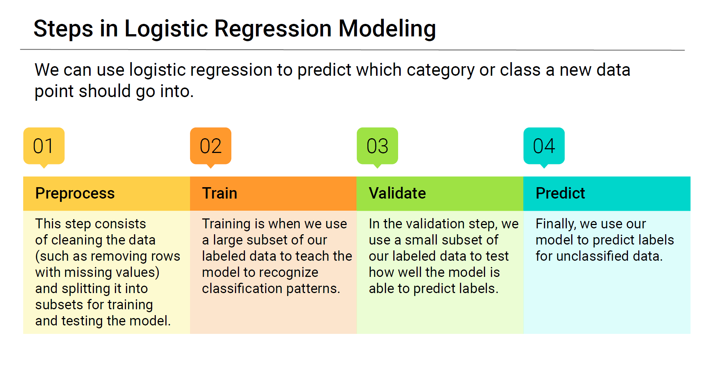
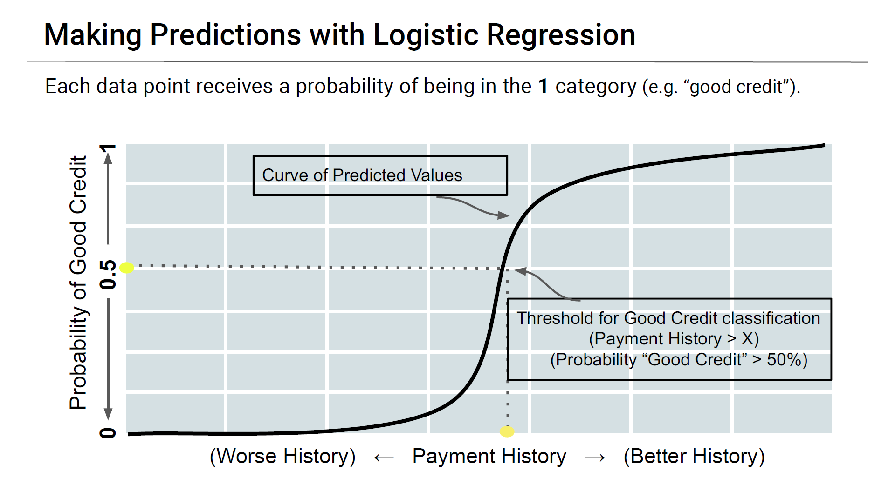
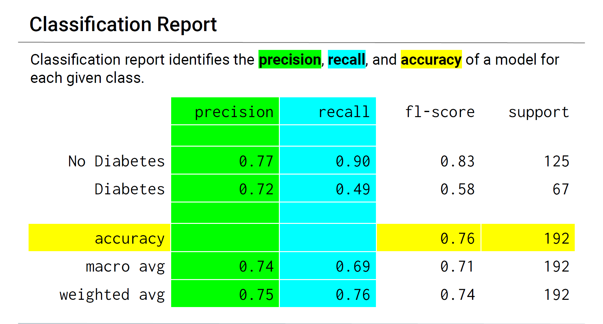

# Credit Risk Report 
### Module 12 Report Template

## Overview of the Analysis

In this excersize, Python library scikit-learn was used for supervised machine learning to create a model to determine the credit risk of the lending data provided. 

The "target/dependant variable" or "y value" was the `loan_status` indicating if a loan was at risk. While the feature set (Independent Variable) included additional data points collected such as `loan_size`

* The purpose of the analysis is to predict the risk of a loan based on the information gathered about the clients. The model will be used to assess wether a loan applicant is creditworthy, or a credit-risk

* The financial information was based on several datat points gathered including;

  * loan_size
  * interest_rate
  * borrower_income
  * debt_to_income
  * num_of_accounts
  * derogatory_marks

---

As with any Machine Learning processes, the model needs to be split into training, and testing sets before we can make any predictions as per the image below.

## Model

The model used a Logistic Regression Model (`LogisticRegression`) with the Original Data and then crafted a Logistic Regression Model with Resampled Training Data (`RandomOverSampler`). A confusion matrix was also used to visualse the false negative, false positive, true negative and true positive outcomes.

The Result was a Probability of risky loan of 0, or 1.
> **Note** A value of `0` in the “loan_status” column means that the loan is healthy. A value of `1` means that the loan has a high risk of defaulting.  

## Results
### Classification Reports

## Machine Learning Model 1:

### Original Logistic Regression model 

              precision    recall  f1-score   support

    Healthy        1.00      0.99      1.00     18765
    Risky          0.85      0.91      0.88       619

    accuracy                            0.99     19384
    macro avg       0.92      0.95      0.94     19384
    weighted avg    0.99      0.99      0.99     19384

## Machine Learning Model 2:

### Oversampled Training model 

              precision    recall  f1-score   support

    Healthy         1.00      0.99      1.00     18765
    Risky           0.84      0.99      0.91       619

    accuracy                            0.99     19384
    macro avg       0.92      0.99      0.95     19384
    weighted avg    0.99      0.99      0.99     19384

## Summary

Using Machine learning, we can effectively train and model data to prevent fraud based on data collectved from customers. 

 oversampling the training model, we managed to get an result that was had a high accuracy of predicting risky loans. 
 
 False positives where users are flagged as wisky, but are actually healthy will mean that certain customers will be blocked from taking out legitimate loan, sacrificing some of the bottom line revenue, however, predicting the frauduelent activity is more iportant because the purpose of this analysis is to reduce the amount of risky loans and there is a high likelyhood that the risky loans costly.

